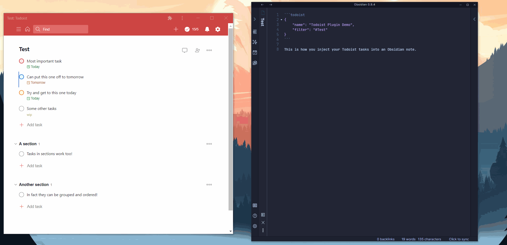

# Obsidian x Todoist Plugin

 

An experimental [Obsidian](https://obsidian.md/) plugin to materialize [Todoist](https://todoist.com/) task lists in Obsidian notes.

_Tested with Obsidian 0.9.10 your results may vary!_



## Usage

1. Download `main.js` and `manifest.json` from the [latest release](https://github.com/jamiebrynes7/obsidian-todoist-plugin/releases).
2. Place this into your `${OBSIDIAN_VAULT}/.obsidian/plugin/todoist-sync` directory.
3. Copy your [Todoist API token](https://todoist.com/prefs/integrations) into `.obsidian/todoist-token`. (If you are synchronizing your vault, I recommend ignoring this file for safety reasons).
4. Open Obsidian and ensure that the Todoist plugin is enabled.
5. Place a code block like the following in any note:
   ````markdown
   ```todoist
   {
   "name": "My Tasks",
   "filter": "today | overdue"
   }
   ```
   ````
6. Swap to preview mode and the plugin should replace this code block with the materialized result of that filter.

## Inputs

| Name          | Required | Description                                                                                                       | Type     | Default |
| ------------- | :------: | ----------------------------------------------------------------------------------------------------------------- | -------- | ------- |
| `name`        |    ✓     | The title for the materialized query.                                                                             | string   |         |
| `filter`      |    ✓     | A valid [Todoist filter](https://get.todoist.help/hc/en-us/articles/205248842-Filters)<sup>[1](#footnote-1)</sup> | string   |         |
| `autorefresh` |          | The number of seconds between auto-refreshing. If omitted, the query use the default global settings.             | number   | null    |
| `sorting`     |          | Describes how to order the tasks in the query. Can be any of 'priority' or 'date', or multiple.                   | string[] | []      |
| `group`       |          | Denotes whether this query should have its task grouped by project & section.                                     | bool     | false   |

## CSS

I also maintain an Obsidian theme which has support out of the box for this plugin, for a complete example of CSS for this plugin, check out [the source](https://github.com/jamiebrynes7/moonlight-obsidian-theme/blob/master/src/modules/extensions/todoist.scss).

### General

Any `workspace-leaf` which has an injected Todoist query will have the `contains-todoist-query` class attached to it.

There are also few CSS classes in the generated DOM, which you can use to customize the rendering of the list:

- `.todoist-query-title`: Attached to the header that contains the query title.
- `.todoist-refresh-button`: Attached to the refresh button.
- `.todoist-refresh-spin`: Attached to the refresh icon _when_ the plugin is refreshing the Todoist data.

My CSS for this in the demo above was:

```css
.todoist-query-title {
  display: inline;
}

.todoist-refresh-button {
  display: inline;
  margin-left: 8px;
}

.todoist-refresh-spin {
  animation: spin 1s linear infinite;
}

@-webkit-keyframes spin {
  100% {
    -webkit-transform: rotate(360deg);
  }
}
```

### Priority

Each task (`li` element) generated by the plugin will have a CSS class attached to it to represent that tasks priority. These classes are `todoist-p1`, `todoist-p2`, `todoist-p3`, and `todoist-p4`.

For example:

```css
.todoist-p1 > input[type="checkbox"] {
  /* This matches against the input element rendered for a priority 1 task. */
}
```

### Task Metadata

Task metadata (like date and project/section) are rendered under the task element in a `div` with class `task-metadata`. You can use this to configure the alignment / layout of these elements.

#### Dates

Any date will be rendered in a `div` element with the `task-date` class on it. Any tasks that are overdue will also have the `task-overdue` class attached to the `div`.

The icon rendered with the date has the `task-calendar-icon` class on it. I recommend using CSS to fix the size of the icon (depending on your existing styling). For example:

```css
.task-calendar-icon {
  vertical-align: middle;
  height: 17px;
  width: 17px;
}
```

There are also extra CSS classes associated with the `li` element relating to the date:

- `task-overdue` will be present on the `li` item.
- `has-time` or `has-no-time` will be present on the `li` item depending on if the task has a defined time.

#### Project & Section

Any project / section will be rendered in a `div` element with the `task-project` class on it.

The icon rendered with the date has the `task-project-icon` class on it. I recommend using CSS to fix the size of the icon (depending on your existing styling). For example:

```css
.task-project-icon {
  vertical-align: middle;
  height: 17px;
  width: 17px;
}
```

#### Labels

Any labels will be rendered in a `div` element with the `task-labels` class on it.

The icon rendered with the date has the `task-labels-icon` class on it. I recommend using CSS to fix the size of the icon (depending on your existing styling). For example:

```css
.task-labels-icon {
  vertical-align: middle;
  height: 17px;
  width: 17px;
}
```

---

<a name="footnote-1">1</a>: There are some exceptions in the Todoist API. Checkout [this issue](https://github.com/jamiebrynes7/obsidian-todoist-plugin/issues/34) for details.
